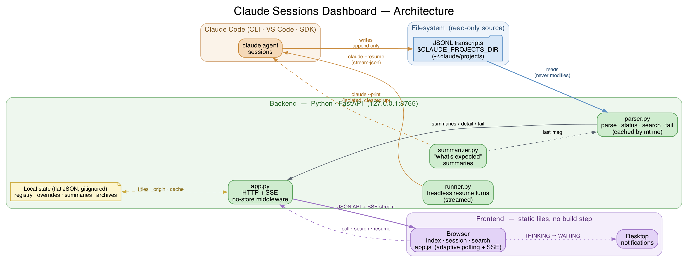

# I Couldn't See What My AI Coding Agent Was Doing — So I Built a Dashboard For It

### A weekend project that turned Claude Code's invisible session logs into a live mission-control for my AI pair programmer

---

If you've spent any real time with an AI coding agent like Claude Code, you know the feeling. You kick off a task, tab away to read Slack, and twenty minutes later you wander back wondering: *Is it still working? Did it finish? Is it stuck waiting for me to approve something? Wait — which of my five terminals was that running in again?*

That tiny moment of friction — multiplied across a dozen sessions a day — is what pushed me to build **Claude Sessions Dashboard**, a small local web app that turns Claude Code's invisible transcript files into a live, browsable mission-control.

This post is the story of why I built it, what I learned, the stack I used, and where I'm taking it next. If you live in an agentic coding workflow, I think you'll recognize the itch.

---

## The motivation: agents are powerful, but they're a black box

Claude Code is genuinely great. But the way it runs creates a visibility problem that nobody really talks about.

Every session — whether you start it from the CLI, VS Code, or the SDK — gets written to disk as a JSONL transcript, quietly tucked away at:

```
~/.claude/projects/<encoded-cwd>/<session-uuid>.jsonl
```

That's a goldmine of structured data. Every user message, every assistant turn, every tool call, every token-usage record — it's all there, append-only, one JSON object per line. But it's **completely invisible** unless you go spelunking through your filesystem with `cat` and `jq`.

So in practice, I had three real pain points:

1. **No overview.** With several projects going at once, I had no single place to see *all* my sessions, their status, and which ones needed me.
2. **No "is it waiting on me?" signal.** The worst failure mode of an agent isn't doing the wrong thing — it's silently *waiting* for a decision while you assume it's still grinding. Idle agents are wasted time.
3. **No memory of where things stood.** Come back the next morning and you've forgotten which session was halfway through a refactor and what it was about to ask you.

I wanted something that felt like a flight tracker for my AI agents: open a browser tab, glance at it, and instantly know who's flying, who's circling, and who's parked at the gate waiting for clearance.

So I built exactly that.

---

## What I built

The dashboard reads those JSONL transcripts — **read-only, never touching Claude's own files** — and gives me a handful of things I now genuinely can't work without:

- **A live dashboard** of every session: title, project path, model, cumulative token usage, and a status pill, all updating in near-real-time.
- **A status model** that infers what each session is doing from how recently its transcript was written — `THINKING`, `WAITING`, `SITTING`, `SLEEPING`, `ENDED`.
- **A "Needs attention" filter** plus **desktop notifications** the moment a session flips from *thinking* to *waiting on me*. This one alone paid for the whole project.
- **A "What's expected from you" summary** — a one-paragraph, LLM-generated recap of exactly what decision a paused session is waiting for, so I don't have to re-read the whole thread.
- **A chat box to resume a session right from the browser**, streaming the reply live.
- **Search** across titles, session IDs, and project paths, with glob wildcards.
- A standalone **CLI transcript viewer** for when I want to tail a running session in the terminal with colorized output.

It's all local, runs on `127.0.0.1`, and starts with a single `./serve.sh`.

---

## Features in action

Words only get you so far — here's what it actually looks like.

### 🛰️ The dashboard: every session at a glance

> **[ SCREENSHOT PLACEHOLDER — `dashboard.png` ]**
> *Insert a full-width screenshot of the main dashboard grid. Show several session
> cards with different status pills (THINKING / WAITING / SLEEPING), the origin
> badges (CLI vs WEB), and the token counts.*

The responsive grid of session cards is home base. Each card shows the title, project
path, status pill, model, cumulative tokens, last activity, and the last two activities —
so I can triage the whole fleet in one glance.

### ⚠️ "Needs attention" + desktop notifications

> **[ SCREENSHOT PLACEHOLDER — `needs-attention.png` ]**
> *Insert a screenshot with the "Needs attention" filter toggled on, plus (if you can
> capture it) the desktop notification popup that fires when a session starts waiting.*

This is the feature that changed my workflow. Toggle the filter to see only the sessions
waiting on a decision, and let the desktop notification ping you the moment one flips from
*thinking* to *waiting*.

### 💬 Session detail + resume-from-the-browser

> **[ SCREENSHOT PLACEHOLDER — `session-detail.png` ]**
> *Insert a screenshot of the detail page: the live status header with the token
> breakdown, the "What's expected from you" summary box, and the chat box at the bottom.*

The detail page streams the full conversation live, shows the one-paragraph
"what's expected from you" summary, and lets me resume the session right there — the
reply streams back token by token.

### 🔍 Search across everything

> **[ SCREENSHOT PLACEHOLDER — `search.png` ]**
> *Insert a screenshot of the search page with a wildcard query (e.g. `*docker*`) and
> its results.*

Find any session by title, ID, or project path — with glob wildcards for when you only
half-remember what you're looking for.

---

## How it all fits together

Here's the whole system on one page — Claude Code writes transcripts to disk, the app
reads them (read-only), and serves a live view to the browser, while the same app can
drive `claude` back through its CLI to resume sessions and generate summaries:



> **[ Replace with the rendered `docs/architecture.png` when publishing on Medium. ]**

The shape is deliberately simple: a single read-only source of truth (the JSONL files),
a thin Python layer over it, and a no-build frontend. Everything else is detail.

---

## The most interesting design problem: there is no "ended" event

Here's a detail I didn't expect to spend so much time on. Claude Code's transcripts have **no explicit "session ended" marker**. A log just... stops getting written to. So how do you show a meaningful status?

I leaned into a **recency heuristic**. Status is derived purely from the time since the file was last modified:

| Status     | Idle time        |
|------------|------------------|
| THINKING   | < 30 s           |
| WAITING    | 30 s – 30 min    |
| SITTING    | 30 min – 2 h     |
| SLEEPING   | 2 h – 24 h       |
| ENDED      | > 24 h           |

The 30-second `THINKING` grace window matters more than it looks: it smooths over the natural pauses *between* tool calls, so the badge doesn't flicker every time the agent stops to think. It's not semantic — a session that literally printed "all done" still ages out by the clock, not by reading the message — but in practice it's shockingly accurate and, importantly, *cheap*. No parsing the meaning of messages, just `os.path.getmtime()`.

This is the kind of pragmatic trade-off I love in a side project: a "dumb" heuristic that's 95% as good as a clever one, for 5% of the complexity.

---

## The tech stack (and why)

I deliberately kept this boring. The whole point was to ship something useful in a weekend, not to audition a framework.

**Backend — Python + FastAPI**

- `parser.py` is the heart: pure, file-based transcript parsing, status inference, search, and tailing. Because it's pure, it's **fully unit-testable without a server** — and it's covered by a 60-test pytest suite.
- It's **cached by mtime/size**, so re-parsing only happens when a file actually changes. Polling stays cheap — about 8ms warm across 250 sessions.
- `app.py` is a thin HTTP layer. `runner.py` handles headless `claude --resume` turns streamed over Server-Sent Events. `summarizer.py` generates those "what's expected" blurbs via a throwaway, isolated `claude --print` call that cleans up after itself.

**Frontend — plain static files. No build step.**

Just `index.html`, `session.html`, `search.html`, one `app.js`, and one `style.css`. No React, no bundler, no `node_modules` black hole. The frontend uses **adaptive polling** — it refreshes roughly every second while any session is active, backs off to every five seconds when everything's idle, and pauses entirely when the tab is hidden. I evaluated WebSockets for push, but honestly, adaptive polling won on simplicity and was indistinguishable in feel.

**State — flat JSON files, gitignored**

Custom titles, web-driven session tracking, and cached summaries live in small JSON files alongside the code. No database. For a single-user local tool, a database would have been ceremony.

The entire thing is one `serve.sh` that spins up a venv, installs three dependencies (FastAPI, uvicorn, pytest), and launches uvicorn. That's the whole footprint.

---

## A small but important detail: don't hardcode the path

When I got ready to open-source this, I hit a classic: I'd hardcoded `~/.claude/projects` in three different files. Fine for me, useless for anyone else whose setup differs.

So before pushing, I made the transcript location configurable via an environment variable, defaulting to the standard path:

```python
PROJECTS_DIR = os.path.expanduser(
    os.environ.get("CLAUDE_PROJECTS_DIR", "~/.claude/projects")
)
```

Now anyone can point it at a custom `CLAUDE_CONFIG_DIR`, a mounted backup, or a different user's home:

```bash
export CLAUDE_PROJECTS_DIR="/path/to/your/.claude/projects"
./serve.sh
```

Small change, but it's the difference between "a script that works on my machine" and "a tool other people can actually run." I also ran a full git-history secret scan before publishing — because the fastest way to ruin an open-source debut is to leak a key in commit number one.

---

## What I gained

Beyond the obvious "I can see my agents now," a few things surprised me.

**1. I stopped losing time to idle agents.** The notification-on-waiting feature changed my whole rhythm. I fire off a task, genuinely context-switch to something else, and get pinged the *instant* the agent needs a decision. No more guilty "is it done yet?" tab-checking.

**2. Working *with* an AI agent on a tool *about* AI agents is a wild feedback loop.** I built much of this dashboard using Claude Code — while watching the very sessions that were building it appear on the dashboard in real time. There's something deeply satisfying about that ouroboros.

**3. Constraints are a gift.** "Read-only, never modify Claude's files" forced a clean separation: all my app's state lives in *separate* files. That single rule kept the architecture honest. If renames or summaries had bled into the transcripts, the whole thing would have become fragile.

**4. Boring tech ships.** No build step, no database, no framework churn. I spent my time on the *product* — the status heuristic, the notification UX, the summary prompt — instead of fighting tooling. The 60 passing tests give me the confidence to keep moving fast.

---

## What's next

This started as a personal itch-scratcher, but a few directions are pulling at me:

- **Full-text search across message content**, not just titles and paths — so I can find "that session where I fixed the auth bug."
- **A stats / usage page** — token and cost rollups across projects, so I can actually see where my quota goes.
- **A changed-files-per-session view**, reconstructed from the `file-history-snapshot` events already sitting in the transcripts.
- **Project grouping and model filters** on the dashboard for when the session list gets long.
- **Per-tool Approve/Deny buttons** in the web chat — which would mean building a small MCP permission server, the most ambitious item on the list.

And the meta-goal: I want this to be the thing I reach for *first* every morning — the dashboard that tells me, at a glance, exactly where every one of my AI collaborators left off.

---

## Try it / steal the ideas

The project is open source here:

> **`https://github.com/fernandokarnagi/claude.sessions`**

If you use Claude Code and you've ever lost a session in a sea of terminal tabs, clone it, point `CLAUDE_PROJECTS_DIR` at your setup, and run `./serve.sh`. And if you build something better — or have a clever idea for the status heuristic — I'd genuinely love to hear it.

The bigger lesson I'm taking away: as we hand more and more work to autonomous agents, **observability stops being a nice-to-have and becomes the interface itself.** You can't manage what you can't see. Sometimes the highest-leverage thing you can build isn't a smarter agent — it's a window into the ones you already have.

---

*If you found this useful, give it a clap and follow along — I'll be writing more about building tooling around AI coding agents.*
