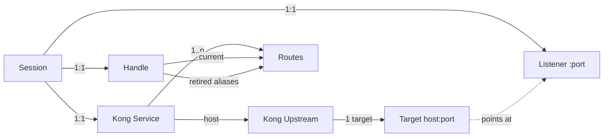
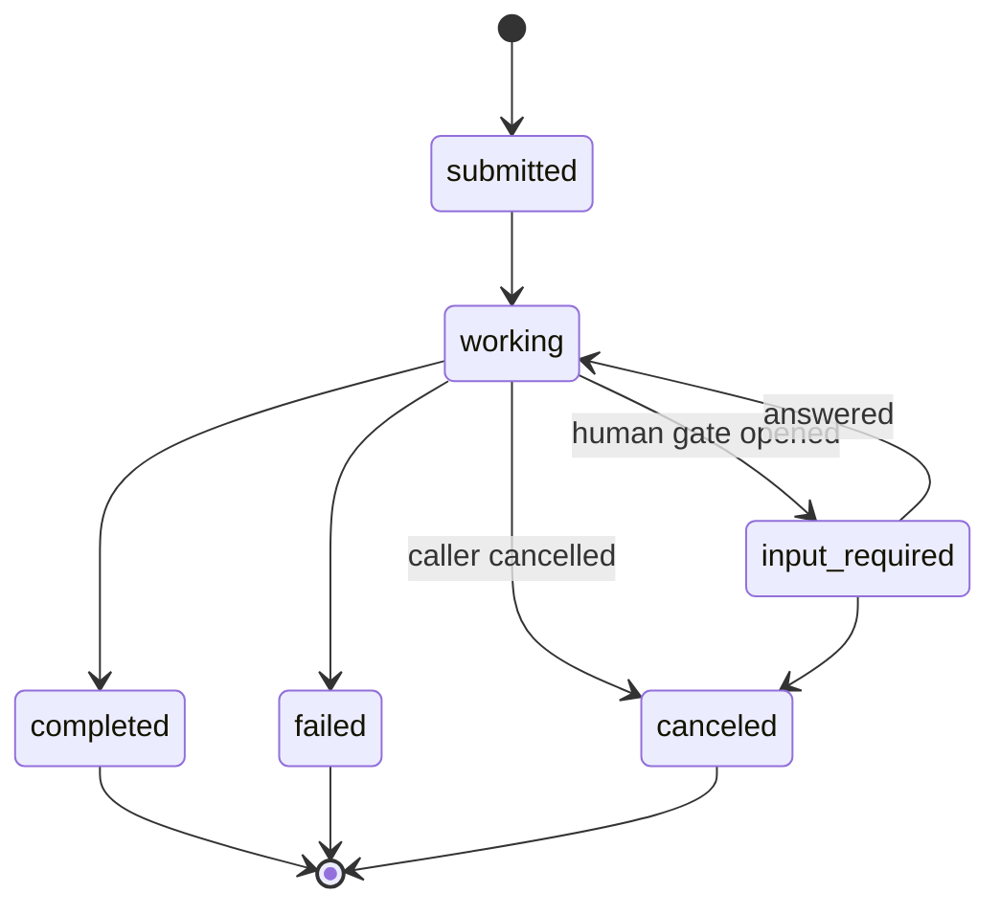

# Agent Gateway Architecture

Publishing live agent sessions as individually addressable A2A services behind Kong.

This document is design only — no implementation detail, no language or framework assumptions. It describes the entity model, the identity rules, the lifecycle, the invariants that must hold, and the contract a host system has to satisfy to adopt it.

---

## 1. The idea

Most agent-gateway designs put the agent **in front of** the gateway: the agent is a client, the gateway governs its calls to models and tools.

This design inverts that. Each running agent session becomes an **upstream service**. The gateway publishes it. Other systems — CI, chat, ticketing, other agents — call it over a standard protocol, authenticated, rate-limited and logged, without knowing that behind the address sits a terminal session, a container, or a hosted runtime.

Consequence: a fleet of agent sessions stops being an internal dashboard concern and becomes an **API estate**.

---

## 2. Layer model

```
    callers: CI · chat · ticketing · other agents · humans
                          │
                     ┌────▼─────┐
                     │   Kong   │   auth · ACL · rate limit · logging
                     │ data plane│   health checks · timeouts · streaming
                     └────┬─────┘
        ┌─────────────────┼─────────────────┐
        │                 │                 │
   ┌────▼────┐       ┌────▼────┐       ┌────▼────┐
   │ agent A │       │ agent B │       │ agent C │   one listener each
   │ listener│       │ listener│       │ listener│   A2A + control API
   └────┬────┘       └────┬────┘       └────┬────┘
        │                 │                 │
   ┌────▼─────────────────▼─────────────────▼────┐
   │              agent runtime                   │  sessions, panes,
   │     (the thing that actually runs agents)    │  transcripts, status
   └────┬─────────────────────────────────────────┘
        │
   ┌────▼──────────────────────────────────────────┐
   │             control plane                      │  identity · ports
   │  registry · lifecycle · gateway reconciliation  │  publication intent
   └────────────────────────────────────────────────┘
```

Four responsibilities, deliberately separated:

| layer | owns | must not |
|---|---|---|
| **Kong data plane** | transport, auth, quota, liveness, logs | know what an agent is |
| **Listener** | protocol conformance for one agent | hold auth or policy |
| **Agent runtime** | actually running the agent | know the gateway exists |
| **Control plane** | identity, allocation, publication | serve caller traffic |

The listener is thin on purpose. It translates protocol into runtime calls and nothing else. All policy lives in the gateway; all bookkeeping lives in the control plane.

---

## 3. Vocabulary

| term | meaning |
|---|---|
| **Session** | one running agent instance in the runtime. Ephemeral. Has an opaque id. |
| **Handle** | the human-readable, stable public name of a session. Derived from its title. |
| **Listener** | a local HTTP endpoint serving exactly one session. |
| **Publication** | operator intent that a session should be reachable from outside. |
| **Card** | the agent's self-description, fetched by callers before they call. |
| **Task** | one unit of work a caller asked an agent to do. Has a lifecycle. |
| **Context** | a conversation thread spanning multiple tasks. |

---

## 4. Entity model

One session maps to a full set of gateway entities. Nothing is shared between sessions.



| concept | Kong entity | why |
|---|---|---|
| session | **Service** | the addressable unit |
| where it listens | **Upstream** with exactly one **Target** | an Upstream is the only thing that gets active health checks; a bare URL service has no liveness |
| public name | **Route** carrying the handle in its path | renames add routes, they don't destroy services |
| previous names | additional **Routes**, marked retired | in-flight callers don't get a 404 mid-job |
| caller | **Consumer** | callers are systems, not agents |
| who may call what | **ACL** groups per agent or per class of agent | access to a reviewer is not access to a production-touching agent |

**The single-target upstream is not redundancy theatre.** It exists so the gateway can probe the agent and stop routing at a dead one. Skipping it collapses the whole liveness story.

---

## 5. Identity

### Handle derivation

Handle comes from the session's human title, slugified: lowercase, non-alphanumeric runs collapsed to a single hyphen, trimmed, length-capped.

```
"Claude SEssion Watcher Dvl"  →  claude-session-watcher-dvl
```

Three rules make it safe:

1. **Reserved names are prefixed.** A handle must never shadow a control-plane path.
2. **Collisions get a deterministic suffix** — a fragment of the session id, never an incrementing counter. A counter reshuffles after a restart and silently re-points a public address at a different agent.
3. **Charset is a strict subset of what the gateway allows in entity names.** No gateway name can then ever be rejected for being malformed.

### Names change, identity doesn't

Handles are derived from titles, and titles get edited. So:

> **Entity names carry the handle. Entity references carry the id.**

The control plane stores the gateway's own identifiers for every entity it creates and addresses them by id forever after. Names are for humans, portals and logs.

A tag on every entity (`agentos`, `session:<id>`) is the backstop: if the control plane's own record is lost, the entire estate can still be rebuilt by querying the gateway by tag.

### Retirement, not deletion

A rename does not delete the old address. The old route stays live, marked retired, for a grace window (24h is a sane default). Only then is it removed. Meanwhile the old handle is blocked from being claimed by a different session.

Rationale: an external caller holds an address. Renaming a session inside a dashboard must not break someone else's pipeline mid-run.

---

## 6. Endpoint allocation

Each session needs its own network endpoint. The design principle:

> **The bind is the allocation.**

Checking whether a port is free and then binding it is a race that cannot be won. Instead: attempt the bind, catch the failure, quarantine that candidate briefly, try the next. The port reported back by the operating system is the only authoritative value.

Allocation preference order:

1. **Sticky** — the endpoint this session used last time. On restart it usually reclaims it, so the gateway target is unchanged and no gateway write happens at all.
2. **Recycled**, oldest-freed first — never lowest-free. Lowest-free hands a just-released endpoint to the next spawn within seconds and destroys sticky reuse.
3. **Unused** from the configured range.
4. **Ephemeral** — let the OS choose. Always succeeds; the endpoint number simply isn't predictable.

The allocation record is a **hint, never a reservation**. Holding endpoints for dead sessions slowly strangles the range. A returning session gets its old endpoint if it's still free and falls through quietly if not.

### Identity verification

Before the control plane ever registers a target, it asks the listener who it is, and compares. A endpoint can be taken over by an unrelated process; without this check the gateway will eventually route a task at a stranger's socket, and the failure will look like a possessed agent.

The same check runs on every reconciliation pass.

---

## 7. Protocol surface

Each listener exposes two contracts on the same address.

### A2A — for machines

```
GET   /.well-known/agent-card.json     self-description
POST  /                                 JSON-RPC 2.0: send, stream, get, cancel, resubscribe
```

### Operational — for the gateway and the control plane

```
GET   /health                           liveness + identity
```

Two card rules matter more than the rest:

- **The card advertises the gateway address, never the listener's.** The card is what a remote client dials. A card pointing at an internal socket leaks topology and is unreachable from outside.
- **The card's declared auth scheme must match the gateway's plugin exactly.** The listener itself has no authentication — the gateway holds it. A card claiming one scheme in front of a route enforcing another fails every conformant client at handshake. Both must be generated from a single configuration value.

### Health semantics

| condition | HTTP | reported state |
|---|---|---|
| runtime instance gone | 503 | `dead` |
| actively working | **200** | `working` |
| waiting on a human | **200** | `input-required` |
| idle and available | 200 | `ready` |

**Busy is not unhealthy.** An agent mid-task returning 503 makes the gateway pull it out of rotation every time it starts thinking. Only a dead instance is unhealthy. This is the single most commonly inverted decision in this design.

---

## 8. Task lifecycle



Task state is **derived from the runtime**, never stored as truth. The running agent is the truth; the task record is a projection with a transition history.

Mapping from a typical runtime's own status vocabulary:

| runtime status | task state |
|---|---|
| actively generating | `working` |
| running sub-agents | `working` |
| idle **with** an open prompt | `input-required` |
| idle with nothing pending | `completed` |
| long-idle | `completed`, flagged stale |
| instance ended | `failed` |

### `input-required` is the centrepiece

Every agent runtime eventually stops and waits for a human — a permission gate, a clarifying question, a multiple-choice prompt. Internally that's a UI problem. Exposed through a protocol, it becomes a **first-class state that external systems can react to**: pause the pipeline, ask in chat, resume.

The pending prompt travels with the task as structured data, so a caller can render the actual choices rather than a wall of text. Free-text answers and choice answers route to different runtime operations.

**Never auto-answer a multiple-choice prompt on behalf of an external caller.** If that rule already exists for internal automation, it binds harder here.

### Send-and-poll is the documented path

Streaming is the optimisation. Agent turns run for minutes, and any catalog or portal "try it" console will render a long-lived stream as a hang. If streaming is the documented path, the API looks broken in the portal that advertises it.

---

## 9. Lifecycle flows

### Publish

```
spawn session
   → allocate endpoint (bind)
   → verify identity via /health
   → mint handle from title
   → create upstream → target → service → route
   → gateway health check turns the target healthy
   → agent is callable
```

Creation order is fixed: **upstream → target → service → route.** Any other order briefly points a live route at something that does not exist.

Publication is gated. A session reaches the gateway only when:

- an operator explicitly marked it published, **and**
- it has outlived a minimum age, **and**
- it is not running in an unrestricted permission mode.

Without the gate, every scratch session becomes a public address and the estate turns to noise.

### Rename (zero downtime)

A service references its upstream **by name**, so renaming the upstream in place breaks routing until the service catches up. Build forward instead:

```
1. create the new upstream + target      (live, unreferenced)
2. update the service: name and host together, one operation
3. add the route for the new handle
4. delete the old upstream               (now unreferenced)
   old route stays until its grace expires
```

Service id survives, so attached plugins, ACLs and consumer bindings survive. No caller sees a gap.

Rename events must be **debounced** — a title edited three times in ten seconds is one rename, not three.

### Teardown

Reverse order: routes → service → target → upstream, then release the endpoint.

More precisely, on shutdown: **close the socket, then remove the gateway entities, then release the record.** Reversed, the gateway keeps routing at a dead endpoint.

### Reconciliation

> Gateway configuration is derived state. Never assume it is correct; recompute it.

A loop on startup and on an interval:

```
for each entity tagged as ours:
    session gone?          → tear down
    name doesn't match?    → rename (same code path as a live rename)
    target unverified?     → re-point or remove

for each published session with no entities:
    → publish
```

This single loop eliminates the entire class of "the gateway was unreachable at the moment I spawned" bugs, and makes every other operation safely retryable.

---

## 10. Invariants

The rules that must hold, stated so they can be tested:

1. A gateway entity is never addressed by name. Only by stored id, or by tag.
2. No target is registered for an endpoint that has not identified itself.
3. A session listens before it is published; it is unpublished before it stops listening.
4. A published handle resolves, or resolves to an explicit "gone" answer — never to a different agent.
5. Busy never reads as unhealthy.
6. A gateway outage degrades publication only. Agents keep running and keep working.
7. Endpoint exhaustion degrades publication only, and is reported, not hidden.
8. Every gateway write is idempotent and safe to replay.
9. Task state is derived from the runtime on read, never trusted from storage.
10. Publication requires explicit intent. Nothing is public by default.

---

## 11. Failure model

| failure | behaviour | recovery |
|---|---|---|
| gateway control API unreachable | session runs unpublished, reason recorded | reconciliation retries |
| gateway data plane down | fleet unreachable from outside; agents unaffected internally | none needed |
| endpoint range exhausted | session runs unpublished, surfaced in UI | reap frees stale entries |
| endpoint stolen by another process | identity check fails, session rebinds elsewhere | automatic, one cycle |
| listener dies, record stale | reaped within one cycle | automatic |
| agent instance dies, session may resume | target unhealthy, route retained through a grace window; callers get a clear "dead" answer, not a 404 | resume re-binds |
| control plane record lost | estate rebuilt from entity tags | reconciliation |
| duplicate titles | deterministic suffix; both addresses valid | none needed |
| rename storm | debounced to one operation | none needed |

Notice the shape: **every failure degrades publication, never the work.** The agent keeps running. That separation is the reason the control plane and the data plane are distinct in the first place.

---

## 12. Design decisions

| decision | alternative rejected | reason |
|---|---|---|
| service per session | pooled upstream per agent role | agent instances are stateful; load balancing across them mixes conversations |
| upstream + single target | plain URL service | only an upstream gets active health checks |
| handle from title | handle from session id | opaque ids are unusable in a catalog or a portal |
| id-based references | name-based lookups | names change on rename; ids don't |
| retirement window | delete old route on rename | external callers hold addresses |
| bind-then-record | check-then-bind | check-then-bind is an unwinnable race |
| advisory sticky hints | reservations | reservations for dead sessions exhaust the range |
| oldest-freed recycling | lowest-free | lowest-free destroys sticky reuse |
| derived task state | stored task state | the runtime is the only truth |
| send-and-poll documented | streaming documented | long streams break portal consoles |
| explicit publication | publish everything live | otherwise the estate becomes noise |

---

## 13. Security model

Traffic now flows **inward**, toward agents that typically hold repository credentials and shell access. That inverts the usual agent threat model, where the concern is what the agent sends out.

| control | placement |
|---|---|
| caller authentication | gateway, per consumer |
| authorization per agent | gateway ACL groups |
| concurrency and rate limits | gateway, per consumer per route |
| request size limits | gateway |
| **inbound prompt inspection** | gateway, or the listener before dispatch |
| audit of who asked what | gateway logging |
| permission restriction on published agents | control plane, enforced at publish |

Three rules worth stating plainly:

1. **Task text from an external caller is untrusted input entering an agent's prompt.** This is now the primary attack surface. Inspect it.
2. **Published agents must not run in unrestricted permission modes.** Enforce at publish time, not by convention.
3. **Destructive operations are never exposed on the public plane.** Spawning, killing, interrupting other sessions, pausing the fleet — those belong on a separate administrative route with separate authorization.

If the protocol's request format hides the user text inside a nested structure, generic content-inspection plugins will not find it. Either lift it for them, or run the check inside the listener before dispatch. Verify this rather than assuming it works.

---

## 14. Host system contract

To adopt this design, the runtime underneath must expose these capabilities. Nothing else is assumed.

| capability | used for |
|---|---|
| enumerate live sessions with ids | registry, reconciliation |
| a human-readable title per session, and notification when it changes | handle derivation, rename |
| a status signal per session: working / idle / waiting-on-human / gone | health, task state |
| the pending prompt when a session is waiting, in structured form | `input-required` payload |
| deliver text to a session | `message/send` |
| answer a structured prompt | answering an `input-required` task |
| interrupt a session | `tasks/cancel` |
| a stream of turn events (optional) | streaming responses |
| a description per session or per agent role (optional) | card and catalog documentation |

Anything supplying those — a terminal multiplexer, a container runtime, a hosted agent API, an SDK loop — can sit under this architecture unchanged.

The optional description capability is worth wiring up: if the runtime already stores agent role definitions as documents, those become the published API documentation for free, and they cannot drift from the agent they describe.

---

## 15. Scaling out

Nothing in the model is single-machine except the default target host.

- Targets are `host:port`. Point them at a node address and the estate spans machines.
- Each node owns its own endpoint range and its own listeners.
- The control plane stays single — it is the registry and the reconciler.
- Node-to-node traffic goes through the gateway, never directly.
- One asymmetry is worth enforcing: **worker nodes may answer, only the control plane may dispatch.** Without it, one compromised agent can command the fleet, and inbound prompt injection becomes lateral movement.

---

## 16. Beyond this document

Natural follow-ons, each independent:

- **Catalog publication** — each published agent as an API product with generated specifications, driven by the same reconciliation loop.
- **Developer portal as an agent portal** — a catalog that changes as agents spawn and die, faceted by role, repository and model, with self-service per-agent access.
- **Per-caller isolation** — a fresh agent instance per task where conversations must not mix.
- **Push notifications** — outbound webhooks on `input-required`, so callers don't poll.
- **Agent-to-agent** — sessions calling each other through the same gateway, turning a fleet into a mesh.

## 17. Protocol version note

Method names, card fields and state vocabularies in the agent-to-agent protocol space have changed more than once. This document encodes a **shape**, not a citation. Verify names and required fields against the specification revision being targeted before building against them.
